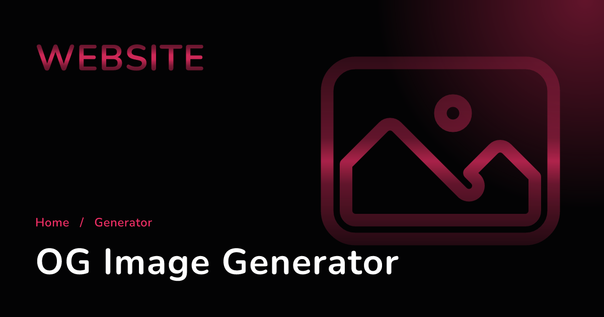
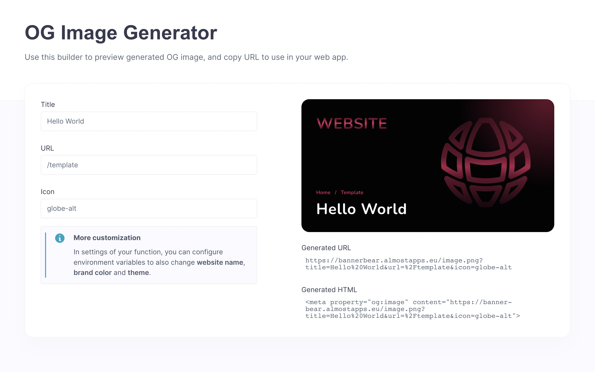

# ⚡ Node.js OG Image Generator Function

Function to dynamically generate OG images for your web app.

## 🧰 Usage

Demo video:


### GET /

Returns HTML website with form to build your OG image HTML tag.

**Response**

Sample `200` Response:

```html
<!doctype html>
...
```



### GET /image.png

Returns PNG of generated OG image.

**Parameters**

| Name   | Description                       | Location   | Type   | Sample Value                     |
| ------ | --------------------------------- | ---------- | ------ | -------------------------------- |
| title | Page title | URL | String | `Hello World`   |
| url | URL of page to genrate subtitle  | FormURL | String | `/template` |
| icon | Icon name from Heroicons to use in OG image design  | URL | String | `globe-alt` |

**Response**

`200` Response:

```json
(image buffer)
```

## ⚙️ Configuration

| Setting           | Value         |
| ----------------- | ------------- |
| Runtime           | Node (18.0)   |
| Entrypoint        | `src/main.js` |
| Build Commands    | `npm install` |
| Permissions       | `any`         |
| Timeout (Seconds) | 15            |

## 🔒 Environment Variables

### THEME

Toggle between dark and light theme for OG image.

| Question      | Answer            |
| ------------- | ----------------- |
| Required      | No                |
| Sample Value  | `dark` or `light` |
| Default Value | `dark`            |

### BRAND_COLOR

Hex color of your brand to personalize OG image color scheme.

| Question      | Answer    |
| ------------- | --------- |
| Required      | No        |
| Sample Value  | `#3b82f6` |
| Default Value | `#f02e65` |

### BRAND_NAME

Name of your company used when generating OG image.

| Question      | Answer     |
| ------------- | ---------- |
| Required      | No         |
| Sample Value  | `Appwrite` |
| Default Value | `Website`  |